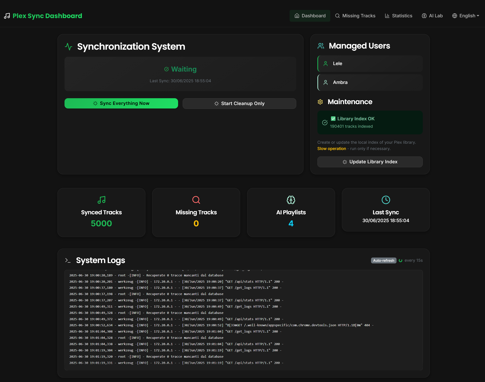
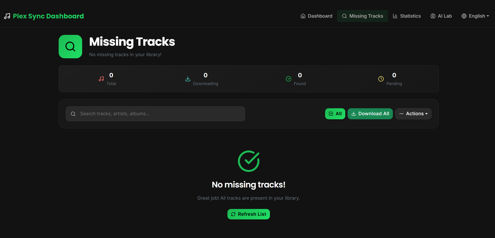
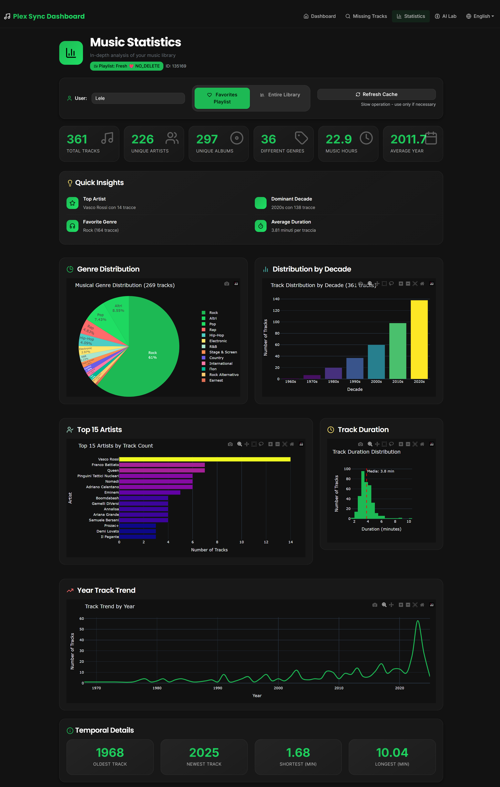
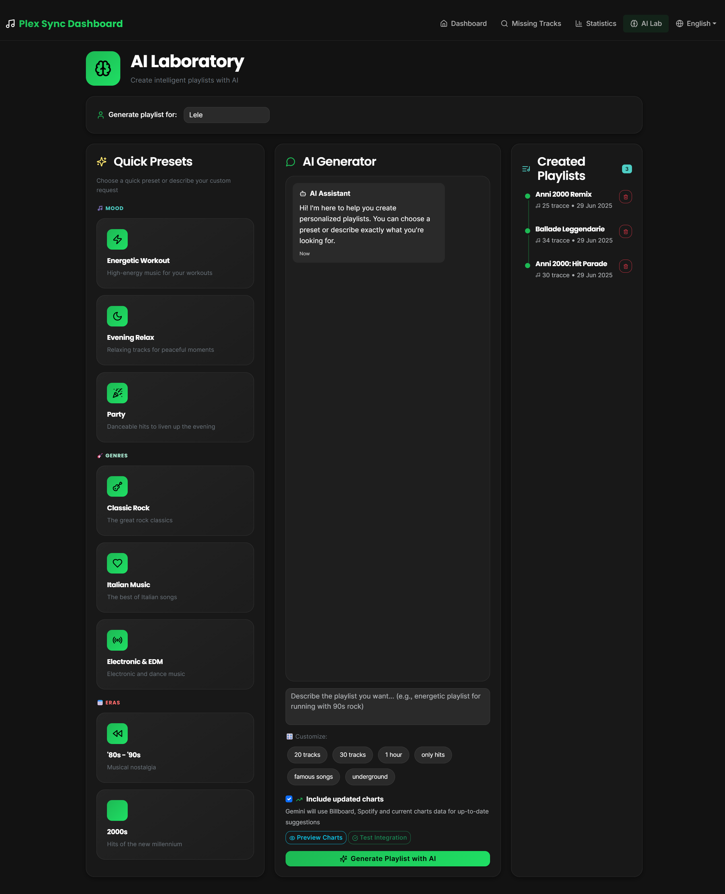

# Plex Sync & Completer


A Python script, executed via Docker, to keep Plex music playlists synchronized with streaming services like Spotify and Deezer. Includes advanced features such as weekly AI playlist creation with Google Gemini and automatic download of missing tracks via `streamrip`.

## ✨ Key Features

- **Multi-Platform Synchronization**: Synchronizes public playlists from **Spotify** and **Deezer** directly into your Plex library.
- **Multi-User Management**: Supports synchronization for multiple Plex users, each with their own playlists and configurations.
- **Weekly AI Playlists**: Uses the **Google Gemini** API to analyze a user's taste (based on a "favorites" playlist) and generate a new personalized playlist every week.
- **Automatic Completion**: Identifies playlist tracks that are missing from your Plex library.
- **Automatic Download**: Uses **`streamrip`** to automatically search and download albums containing missing tracks from Deezer, effectively completing your library.
- **Scheduled Cleanup**: Automatically removes old playlists to keep the library organized.
- **Background Execution**: Designed to run 24/7 in a Docker container, with customizable synchronization cycles.
- **Fast Statistics**: Charts are generated from the favorite tracks playlist, speeding up processing even on very large libraries.
- **Multilingual Interface**: Full bilingual support (English/Italian) with automatic language detection and seamless switching.

## 🌐 Internationalization

The application features a complete bilingual interface supporting both **English** and **Italian** languages:

### Language Features
- **Automatic Detection**: The interface automatically detects the user's preferred language from browser settings
- **Manual Switching**: Users can manually switch between languages using the language selector
- **Complete Translation**: All interface elements are translated including:
  - Dashboard and navigation menus
  - Chart labels and statistics
  - AI assistant messages and prompts
  - Error messages and notifications
  - Form placeholders and buttons

### How Language Switching Works
- **Session-Based**: Language preference is stored in the user's session
- **Dynamic Charts**: All statistical charts (genre distribution, artist rankings, etc.) update their labels based on the selected language
- **AI Integration**: The AI assistant adapts its responses and suggestions to the selected language
- **Real-Time**: Language changes take effect immediately without requiring a page refresh

The language system is powered by a custom i18n service with JSON-based translation files located in `plex_playlist_sync/translations/`.

## 🚀 Getting Started

### Prerequisites

-   [Docker](https://www.docker.com/products/docker-desktop/) and Docker Compose installed.
-   A Plex server with administrative access.
-   A [Deezer](https://www.deezer.com) account (to obtain the ARL).
-   A [Spotify for Developers](https://developer.spotify.com/dashboard) account (for API credentials).
-   A [Google AI Studio](https://aistudio.google.com/) account (for Gemini API key).

## 📋 Configuration Files

Before installation, you need to understand and configure two important files provided as examples:

### `.env.example` File
This file contains all the environment variables needed for the application. It includes:
- **Plex Server Configuration**: URL, tokens, and library settings
- **Streaming Service APIs**: Spotify and Deezer credentials
- **AI Integration**: Google Gemini API key
- **Operational Settings**: Sync intervals, cleanup rules, feature toggles

**Key sections in `.env.example`:**
```bash
# Plex Server Settings
PLEX_URL=http://your-plex-server:32400
PLEX_TOKEN=your_plex_token_here

# Streaming Services
SPOTIFY_CLIENT_ID=your_spotify_client_id
DEEZER_PLAYLIST_ID=123456789,987654321

# AI Features
GEMINI_API_KEY=your_gemini_api_key
PLEX_FAVORITES_PLAYLIST_ID_MAIN=12345

# Operational Settings
SECONDS_TO_WAIT=86400
RUN_DOWNLOADER=1
RUN_GEMINI_PLAYLIST_CREATION=1
```

### `config.example.toml` File
This is the configuration file for `streamrip` (the download engine). The most important setting is:
```toml
[deezer]
arl = "your_deezer_arl_token_here"
```

**How to get your Deezer ARL:**
1. Log into Deezer in your browser
2. Open Developer Tools (F12)
3. Go to Application/Storage > Cookies
4. Find the `arl` cookie value
5. Copy this value to the config file

### ⚙️ Installation Methods

Choose your preferred installation method:

#### Method 1: Docker Compose (Command Line)

1.  **Clone the Repository**
    ```bash
    git clone <YOUR_PRIVATE_REPOSITORY_URL>
    cd Plex-Library-Completer
    ```

2.  **Configure Environment Variables**
    Copy and customize the environment file:
    ```bash
    cp .env.example .env
    ```
    Edit `.env` with your preferred text editor and fill in all the required values according to the Environment Variables table below.

3.  **Configure Streamrip**
    Copy and customize the streamrip configuration:
    ```bash
    cp config.example.toml config.toml
    ```
    Edit `config.toml` and add your Deezer ARL token.

4.  **Verify Volume Paths**
    Edit `docker-compose.yml` and update the music library path:
    ```yaml
    volumes:
      - /path/to/your/music:/music # <-- Update this path
      # ... other volumes
    ```

#### Method 2: Portainer Installation

If you're using Portainer for Docker management:

1.  **Prepare Configuration Files**
    Create a folder on your server (e.g., `/opt/plex-completer/`) and place:
    - Your configured `.env` file (copied from `.env.example`)
    - Your configured `config.toml` file (copied from `config.example.toml`)
    - The `docker-compose.yml` file

2.  **Create Stack in Portainer**
    - Go to Portainer > Stacks > Add Stack
    - Choose "Upload" method
    - Upload your `docker-compose.yml` file
    - In the "Environment variables" section, either:
      - Upload your `.env` file, OR
      - Manually add each environment variable

3.  **Configure Volumes**
    In the docker-compose.yml, ensure paths are correct for your server:
    ```yaml
    volumes:
      - /opt/plex-completer/.env:/app/.env
      - /opt/plex-completer/config.toml:/root/.config/streamrip/config.toml
      - /path/to/your/music:/music
      - ./state_data:/app/state_data
    ```

4.  **Deploy Stack**
    - Review your configuration
    - Click "Deploy the stack"
    - Monitor logs in Portainer to ensure everything starts correctly

#### Method 3: Portainer with Git Repository

For easier updates:

1.  **Create Stack from Git**
    - Go to Portainer > Stacks > Add Stack
    - Choose "Repository" method
    - Enter your repository URL
    - Set the Compose path to `docker-compose.yml`

2.  **Environment Configuration**
    - In Portainer, add all environment variables manually, OR
    - Pre-place your `.env` file in the repository (not recommended for security)

3.  **Additional Configuration**
    - Ensure `config.toml` is accessible to the container
    - Set up volume mappings for your music library

### ▶️ Execution

#### Docker Compose (Command Line)

To start the container in the background:
```bash
docker-compose up -d --build
```
The `--build` flag is recommended the first time or after code changes.

To view logs in real time:
```bash
docker-compose logs -f
```

To stop the container:
```bash
docker-compose down
```

#### Portainer

If using Portainer:
1. **Start**: Click the "Start" button on your stack in Portainer
2. **View Logs**: Go to Containers > [container-name] > Logs for real-time monitoring
3. **Stop**: Click the "Stop" button on your stack
4. **Update**: Use "Pull and redeploy" to update the container with new images
5. **Restart**: Use the "Restart" button to restart the stack after configuration changes

#### Web Interface

Once running, access the web interface at:
- **Local**: `http://localhost:5000`
- **Network**: `http://[your-server-ip]:5000`

The interface provides:
- Dashboard with sync status and statistics
- Missing tracks management
- AI playlist laboratory
- Detailed music statistics and charts

## Environment Variables (`.env`)

This is the complete list of variables to configure in the `.env` file.

| Variable                       | Description                                                                                              | Example                                       |
| ------------------------------- | -------------------------------------------------------------------------------------------------------- | --------------------------------------------- |
| `PLEX_URL`                      | URL of your Plex server.                                                                                | `http://192.168.1.10:32400`                   |
| `PLEX_TOKEN`                    | Access token for the main Plex user.                                                                    | `yourPlexTokenHere`                           |
| `PLEX_TOKEN_USERS`              | Access token for the secondary Plex user (optional).                                                    | `secondaryUserPlexToken`                      |
| `LIBRARY_NAME`                  | Exact name of your music library on Plex.                                                               | `Music`                                       |
| `DEEZER_PLAYLIST_ID`            | Numeric IDs of Deezer playlists to sync for the main user, comma-separated.                           | `12345678,87654321`                           |
| `DEEZER_PLAYLIST_ID_SECONDARY`  | Deezer playlist IDs for the secondary user, comma-separated (optional).                               | `98765432`                                    |
| `SPOTIFY_CLIENT_ID`             | Client ID obtained from Spotify for Developers dashboard.                                              | `yourSpotifyClientID`                         |
| `SPOTIFY_CLIENT_SECRET`         | Client Secret obtained from Spotify for Developers dashboard.                                          | `yourSpotifyClientSecret`                     |
| `GEMINI_API_KEY`                | API key obtained from Google AI Studio for AI functions.                                              | `yourGeminiApiKey`                            |
| `PLEX_FAVORITES_PLAYLIST_ID_MAIN` | Rating Key (numeric ID) of the "favorites" Plex playlist for the main user (for AI).                 | `12345`                                       |
| `PLEX_FAVORITES_PLAYLIST_ID_SECONDARY` | Rating Key of the "favorites" playlist for the secondary user (optional, for AI).                   | `54321`                                       |
| `SECONDS_TO_WAIT`               | Seconds to wait between synchronization cycles.                                                        | `86400` (24 hours)                            |
| `WEEKS_LIMIT`                   | Number of weeks after which old playlists are deleted.                                                 | `4`                                           |
| `PRESERVE_TAG`                  | If this text is in a playlist title, it will not be deleted.                                          | `NO_DELETE`                                   |
| `FORCE_DELETE_OLD_PLAYLISTS`    | Set to `1` to enable automatic deletion of old playlists.                                             | `0` (disabled)                                |
| `RUN_DOWNLOADER`                | Set to `1` to enable automatic download of missing tracks.                                            | `1` (enabled)                                 |
| `RUN_GEMINI_PLAYLIST_CREATION`  | Set to `1` to enable weekly AI playlist creation.                                                     | `1` (enabled)                                 |

## Project Structure

```
Plex-Library-Completer/
├── .env                  # Your secret environment variables
├── .gitignore            # Files and folders to ignore for Git
├── config.toml           # Streamrip configuration (e.g. ARL)
├── docker-compose.yml    # Docker orchestration file
├── Dockerfile            # Instructions to build the image
├── README.md             # This file
├── requirements.txt      # Python dependencies
│
└── plex_playlist_sync/   # Application source code
    ├── run.py
    └── utils/
        ├── cleanup.py
        ├── deezer.py
        ├── downloader.py
        └── ...
```

## 🔧 Troubleshooting Configuration

### Common Configuration Issues

#### `.env` File Problems
- **Missing Variables**: Ensure all required variables from `.env.example` are present
- **Invalid Tokens**: Verify Plex tokens, Spotify credentials, and Gemini API key are correct
- **Path Issues**: Ensure file paths use forward slashes and are accessible to Docker
- **Quotes**: Avoid unnecessary quotes around values unless they contain spaces

#### `config.toml` File Problems
- **Invalid ARL**: The Deezer ARL token expires periodically and needs to be refreshed
- **File Location**: Ensure the file is in the correct location for Docker to mount it
- **Syntax Errors**: Validate TOML syntax - use a TOML validator if needed

#### Portainer-Specific Issues
- **Environment Variables**: Ensure all `.env` variables are properly imported into Portainer
- **Volume Mounts**: Verify that config files are correctly mounted into the container
- **File Permissions**: Check that Portainer has read access to your configuration files
- **Stack Updates**: After changing configuration, restart the stack rather than just the container

#### Quick Validation Commands

Test your configuration before deployment:
```bash
# Validate .env file has all required variables
grep -E "^[A-Z_]+=.+" .env | wc -l

# Check if config.toml has ARL
grep "arl" config.toml

# Validate TOML syntax
python3 -c "import toml; toml.load('config.toml')"
```

### Getting Help

If you encounter issues:
1. Check the container logs for specific error messages
2. Verify all configuration files are properly formatted
3. Ensure all external services (Plex, Spotify, Deezer) are accessible
4. Test API credentials independently before using them in the application

## 📸 Example Images



