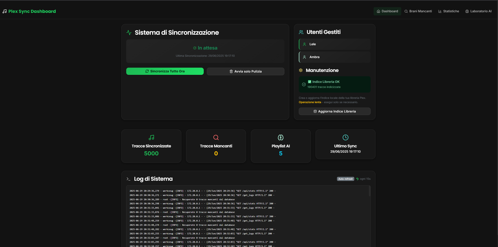
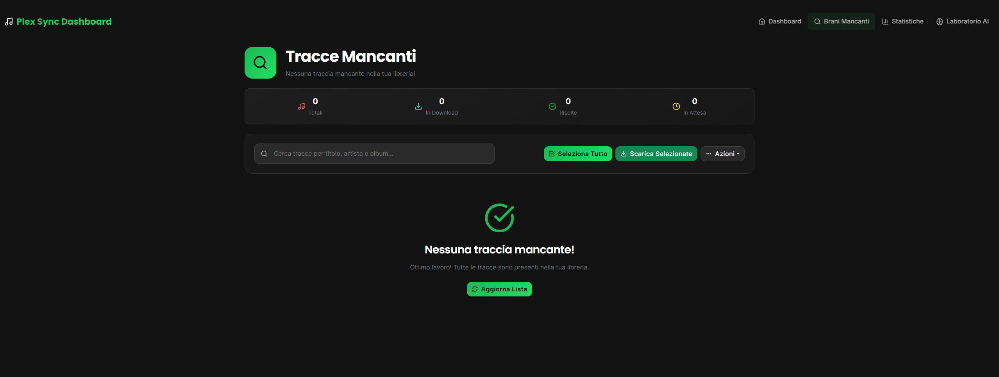
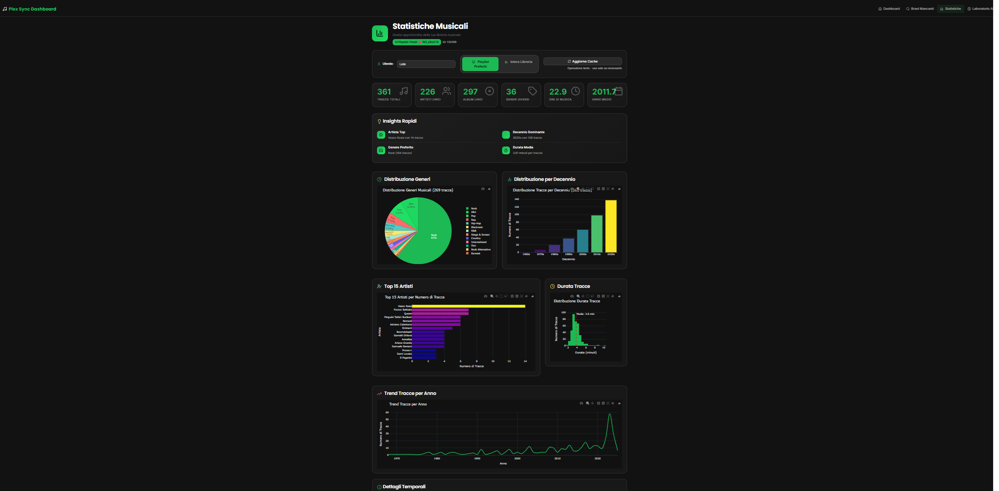
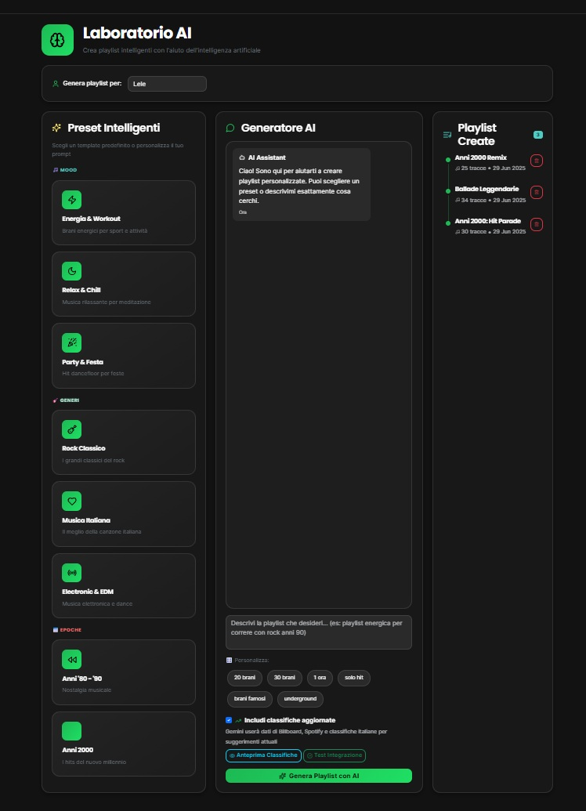

# Plex Sync & Completer


Uno script Python, eseguito tramite Docker, per mantenere sincronizzate le playlist musicali di Plex con servizi di streaming come Spotify e Deezer. Include funzionalità avanzate come la creazione di playlist settimanali tramite IA con Google Gemini e il download automatico dei brani mancanti tramite `streamrip`.

## ✨ Funzionalità Principali

- **Sincronizzazione Multi-Piattaforma**: Sincronizza le playlist pubbliche da **Spotify** e **Deezer** direttamente nella tua libreria Plex.
- **Gestione Multi-Utente**: Supporta la sincronizzazione per più utenti Plex, ognuno con le proprie playlist e configurazioni.
- **Playlist AI Settimanali**: Utilizza l'API di **Google Gemini** per analizzare i gusti di un utente (basandosi su una playlist di "preferiti") e generare una nuova playlist personalizzata ogni settimana.
- **Completamento Automatico**: Identifica le tracce delle playlist che mancano nella tua libreria Plex.
- **Download Automatico**: Utilizza **`streamrip`** per cercare e scaricare automaticamente da Deezer gli album contenenti i brani mancanti, completando di fatto la tua libreria.
- **Pulizia Programmata**: Rimuove automaticamente le vecchie playlist per mantenere la libreria ordinata.
- **Esecuzione in Background**: Progettato per essere eseguito 24/7 in un container Docker, con cicli di sincronizzazione personalizzabili.
- **Statistiche Veloci**: I grafici vengono generati partendo dalla playlist dei brani preferiti, velocizzando l'elaborazione anche su librerie molto grandi.

## 🚀 Iniziare

### Prerequisiti

-   [Docker](https://www.docker.com/products/docker-desktop/) e Docker Compose installati.
-   Un server Plex con accesso amministrativo.
-   Un account [Deezer](https://www.deezer.com) (per ottenere l'ARL).
-   Un account [Spotify for Developers](https://developer.spotify.com/dashboard) (per le credenziali API).
-   Un account [Google AI Studio](https://aistudio.google.com/) (per la chiave API di Gemini).

### ⚙️ Installazione e Configurazione

1.  **Clona il Repository**
    (Una volta pubblicato su GitHub)
    ```bash
    git clone <URL_DEL_TUO_REPOSITORY_PRIVATO>
    cd Plex-Library-Completer
    ```

2.  **Crea il file `.env`**
    Copia il file di esempio `.env.example` nella radice del progetto e rinominalo in `.env`.
    ```bash
    cp .env.example .env
    ```
    Successivamente, apri il file `.env` e inserisci tutti i tuoi valori personali.

3.  **Crea il file `config.toml`**
    Questo file è per la configurazione di `streamrip`. Copia `config.example.toml` e rinominalo in `config.toml`.
    ```bash
    cp config.example.toml config.toml
    ```
    Apri `config.toml` e inserisci il tuo ARL di Deezer.

4.  **Verifica i Percorsi dei Volumi**
    Apri il file `docker-compose.yml` e assicurati che il percorso della tua libreria musicale sia corretto. Sostituisci `M:\Organizzata` con il percorso reale sul tuo PC.
    ```yaml
    volumes:
      - M:\Organizzata:/music # <-- Modifica questo percorso
      # ... altri volumi
    ```

### ▶️ Esecuzione

Per avviare il container in background:
```bash
docker-compose up -d --build
```
Il flag `--build` è consigliato la prima volta o dopo modifiche al codice.

Per visualizzare i log in tempo reale:
```bash
docker-compose logs -f
```

Per fermare il container:
```bash
docker-compose down
```

##  Variables d'Ambiente (`.env`)

Questa è la lista completa delle variabili da configurare nel file `.env`.

| Variabile                       | Descrizione                                                                                              | Esempio                                       |
| ------------------------------- | -------------------------------------------------------------------------------------------------------- | --------------------------------------------- |
| `PLEX_URL`                      | URL del tuo server Plex.                                                                                 | `http://192.168.1.10:32400`                   |
| `PLEX_TOKEN`                    | Token di accesso per l'utente Plex principale.                                                           | `yourPlexTokenHere`                           |
| `PLEX_TOKEN_USERS`              | Token di accesso per l'utente Plex secondario (opzionale).                                               | `secondaryUserPlexToken`                      |
| `LIBRARY_NAME`                  | Nome esatto della tua libreria musicale su Plex.                                                         | `Musica`                                      |
| `DEEZER_PLAYLIST_ID`            | ID numerici delle playlist Deezer da sincronizzare per l'utente principale, separati da virgola.         | `12345678,87654321`                           |
| `DEEZER_PLAYLIST_ID_SECONDARY`  | ID delle playlist Deezer per l'utente secondario, separati da virgola (opzionale).                       | `98765432`                                    |
| `SPOTIFY_CLIENT_ID`             | Client ID ottenuto dalla dashboard per sviluppatori di Spotify.                                          | `yourSpotifyClientID`                         |
| `SPOTIFY_CLIENT_SECRET`         | Client Secret ottenuto dalla dashboard per sviluppatori di Spotify.                                      | `yourSpotifyClientSecret`                     |
| `GEMINI_API_KEY`                | Chiave API ottenuta da Google AI Studio per le funzioni AI.                                              | `yourGeminiApiKey`                            |
| `PLEX_FAVORITES_PLAYLIST_ID_MAIN` | Rating Key (ID numerico) della playlist Plex dei "preferiti" per l'utente principale (per l'IA).         | `12345`                                       |
| `PLEX_FAVORITES_PLAYLIST_ID_SECONDARY` | Rating Key della playlist "preferiti" per l'utente secondario (opzionale, per l'IA).                  | `54321`                                       |
| `SECONDS_TO_WAIT`               | Secondi di attesa tra un ciclo di sincronizzazione e l'altro.                                            | `86400` (24 ore)                              |
| `WEEKS_LIMIT`                   | Numero di settimane dopo cui le vecchie playlist vengono eliminate.                                      | `4`                                           |
| `PRESERVE_TAG`                  | Se questo testo è nel titolo di una playlist, non verrà eliminata.                                       | `NO_DELETE`                                   |
| `FORCE_DELETE_OLD_PLAYLISTS`    | Imposta a `1` per attivare la cancellazione automatica delle vecchie playlist.                           | `0` (disattivato)                             |
| `RUN_DOWNLOADER`                | Imposta a `1` per attivare il download automatico dei brani mancanti.                                    | `1` (attivato)                                |
| `RUN_GEMINI_PLAYLIST_CREATION`  | Imposta a `1` per attivare la creazione settimanale delle playlist AI.                                   | `1` (attivato)                                |

## Struttura del Progetto

```
Plex-Library-Completer/
├── .env                  # Le tue variabili d'ambiente segrete
├── .gitignore            # File e cartelle da ignorare per Git
├── config.toml           # Configurazione di Streamrip (es. ARL)
├── docker-compose.yml    # File di orchestrazione di Docker
├── Dockerfile            # Istruzioni per costruire l'immagine
├── README.md             # Questo file
├── requirements.txt      # Dipendenze Python
│
└── plex_playlist_sync/   # Codice sorgente dell'applicazione
    ├── run.py
    └── utils/
        ├── cleanup.py
        ├── deezer.py
        ├── downloader.py
        └── ...
```
## Image exemple




